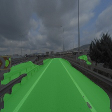
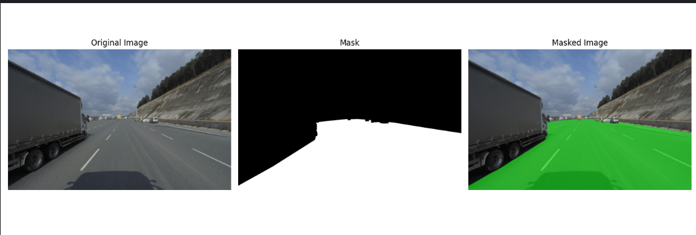

## 🧠 Model

- Architecture: Fully Convolutional Neural Network (FCNN)
- Framework: PyTorch
- Output: Binary segmentation masks (Freespace / Not Freespace)

## 🛠️ Pipeline

1. **Annotation → Mask Conversion** using OpenCV
2. **Tensorization** of images and masks
3. **Model Training** with loss tracking and validation
4. **Prediction** on test images
5. **Visualization** of results

---

## 🖼️ Example Outputs

| Predicted Mask | Original Image with Overlay |
|-----------------------------|----------------|
|  |  |

---

## 📈 Training Performance

- 469 annotated image-mask pairs
- Trained for 20 epochs
- Achieved validation loss: **~0.17**

---
